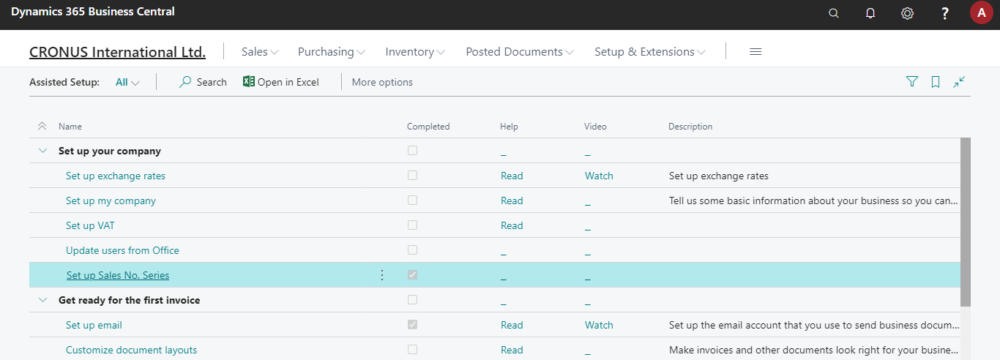
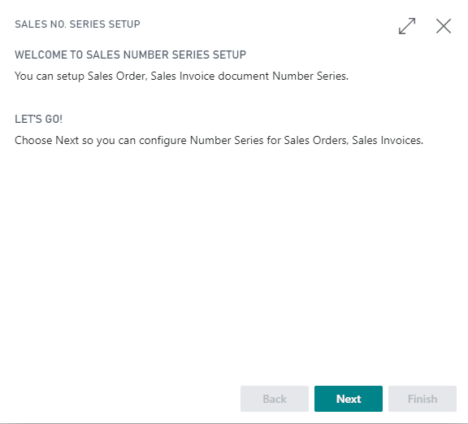

# Sample Code for Assisted Setup

This repository contains sample project for creating Microsoft Dynamics 365 Business Central `Assisted Setup`

# Assisted Setup in Action

Assisted Setup

Wizard Page

To know more about `Assisted Setup` read this [post](https://www.msnjournals.com/post/how-to-create-assisted-setup-for-your-business-central-extension)
